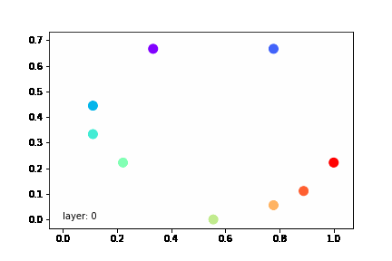

### Image registration for shapes that match through diffeomorphisms, inspired by LDDMMs and implemented with Neural Networks as ODEs

An example:

This is a simple (and slightly incomplete) implementation of https://arxiv.org/abs/2102.07951.

This paper introduces neural nets as discrete ODE solvers, and specifically employs one that uses the forward Euler scheme by learning kinetic energy minimising trajectories. In fact, the learnt register is that of LDDMM methods. The resulting learnt network is able to produce a diffeomorphic shape register showing the shapes morphism given a starting and ending frame. My implementation is incomplete as it uses L2 as the data term instead of Earth Mover's or Chamfer's distance. This is due to still implementing Sinkhorn's algorithm.

My scrapbook notes to this paper now follows:

The problem statement.
---
Image registration is the process of finding some set of coordinates describing all possible deformations of a shape given the shape's properties. It's heavily used in statistical medical analysis and in medical diagnoses. For example, if different medical equipment from different medical facilities observe a single patient's lungs, registering the patients lungs allows for a far more seamless integration of varying medical data, especially if data is observed at varying times. The registration will allow for minding the most likely trajectory the shape took through time to get from its source shape to its target shape. The picture at the start of the blog illustrates the register of a fencer through a few seconds of time.

LDDMM methods have been a recently popular and highly successful method for estimating such flows. By comparing the group structure of the manifold of diffeomorphisms of $R^3$, it gives a formulation for kinetic energies of certain deformations, and is therefore able to compare shapes according to the energy requires to shift from one to the other. Due to our bodies evolving in a way as to minimise energy loss, this allows for prediction of intermediary changes between two shapes, ie) that of two medical scans taken within some time-interval.

The image at the start of this post is that of what's capable using RESNET-LDDMM. Due to having a wee little laptop, I instead use a different dataset to show the power of LDDMM's, however there is no non-computational reason limiting the production of the above image. MIT's MoSculp uses neural networks to find points on moving objects that it then tracks and forms a 4D (space and time) model out of. Effectively, it registers the observed flow of the shape, as is the topic of this post. It requires a video as input, and as output produces the time-sculpture. This paper allows to do exactly what's been done with MoSculp, however just requires the first and last video frame. RESNET-LDDMM fills in all the rest!

Initial Formulation
---
Let $q_S=(x_1, ..., x_n)^T \in R^{3n}$ and $q_T=(x_1, ..., x_n)^T \in R^{3n}$ represent the initial and final 3D point clouds which define an n-dimensional shape embedded in $R^3$. Further, assume that $x_i=x_j \Rightarrow i=j$. Let $f: [0, 1].R^3 \to R^3$ denote the shape's time-dependant velocity field, with $\phi: [0, 1].R^3 \to R^3$ the time-dependant transform. The _flow equation_ 

$$\dot\phi(t, x) = f(t, \phi(t, x)), \phi(0, x) = x$$ 

for all $x \in R^3$ and $t \in [0, 1]$ therefore define the evolution of the initial shape according to the dynamics imposed by $f$.

The dynamics of the flow have some self-imposed conditions due to the nature of the problem. Generally speaking, if a medical scan of some body part (like an arm)is a shape that wouldn't (topologically) change the number of holes it has, or form angular kinks - instead as the shape moves, it would maintain the properties of smooth curviture and topology (like flexing the arm, doesn't create holes, and precise angles don't form at a small enough scale). These restrictions result in the shape having a diffeomorphic flow. This imposes a restriction on $f$, namely that (1) $f$ is globally lipschitz for a fixed $t$, and (2) $f$ has a time-dependant lipschitz constant integrable in time. These restrictions, by the Picard-Lindelf theorem, give invertible and essentially diffeomorphic flows.

LDDMM computes diffeomorphic transformations by integrating the velocity field $f$ through time $t$, finding the optimal trajectory $\phi(t, .)$ connecting $\phi(0, .)$ to $\phi(1, .)$. Specifically, the optimal velocity field $f^*$ _minimises_ 

$$\frac{1}{2\sigma^2} D(\phi^f(1).q_S, q_T) + \frac{1}{2} \int_0^1 \lVert{f(t, .)}\rVert_2^2 dt$$

$\phi^f(1).q_S$ represents the resulting configuration of the initial shape $q_S$ upon being acted by the flow $\phi$ with dynamics determined by $f$ at $t=1$. Therefore the first term defines the distance between the source shape and the target shape upon evolval by the system $/phi$. This is the _data term_.

The second term represents the integral of the velocity field generated by $f$ through the considered course of shape change. With energy loss minimisation considerations, this computes the kinetic energy of the entire transformation. This is the _regularisation term_.

Minimising these two terms by considering all the admissable dynamics defined by $f$ given shape $phi$ therefore finds the optimal diffeomorphism that (1) results in a shape morphing close to the expected target shape, and (2) minimises the cumulative kinetic energy (and therefore energy loss) required to do the transformation.

LDDMM exploits the fact that the space of integrable (over $t \in [0, 1]$) diffeomorphisms $f$ endowed with a metric given by the infimum of the cumulative kinetic energy of shape-matching flows between the two respective point clouds forms a complete metric space. The determination of scale of smooth velocity fields then induces a reproducing kernel hilbert space which gives the admissable search space of diffeomorphic flows.

The Neural-ODE equivalence.
---

LDDMM seeks to, under some assumptions, (1) minimise the sum of the data and registration terms, and (2) implicitely solve the ODE describing the shape motion.

As proposed by Sylvain Arguillere, Boulbaba Ben Amor, and Ling Shao, this can be very neatly formulated into the language of neural nets:

(1) The data + regularisation terms can be minimised via gradient descent by considering them as the loss function.

(2) A special class of neural net: residual nets, propagate information similar to that of the iterative forward-euler method for approximating solutions to ODEs.

Hence, residual nets can be used to solve ODEs, specifically finding the dynamics which describe suitable shape registrations.

From forward-euler method to residual blocks.
---

Let $\dot\phi(t, x) = f(t, \phi(t, x)), \phi(0, x) = x$ be the flow equation as priorly defined. Then the discretised ODE solution, given by the forward-euler method, is $\phi(t_n, x) = \phi(t_{n-1}, x) + \Delta f(t_{n-1}, \phi(t_{n-1}, x))$ for discretised times steps $t_0, t_1, ...$ given by the size $\Delta$. Therefore, the ODE solution is propagated by taking a step in the direction of the total derivative at the current point with some step-size $\Delta$. This method assumes knowledge of $f$.

The output of a residual block given signal $x$ is $x + f(x)$, where $f$ is the learnable function. Computationally, the time-step can be highlighted by having the residual block learn $x + \Delta f(x)$, for a user-defined step $\Delta$.

Therefore, by stacking residual blocks ontop of one another, one can construct a discretised ODE solver that learns the most appropriate $f$ at each time step according to cumulative minimal kinetic energy and shape matching requirements! Further, pruning post-activations from each layer will generate the optimised discretised flow.

Properties of neural nets that aid the diffeomorphic registration problem
---

The prior section shows how residual blocks can be composed to solve an ODE, with the loss function specifying solutions that are low in energy loss and try to get a final match to the target shape. To finish the equivalence with LDDMM, one requires that the search space $f$ in residual blocks be diffeomorphic. Luckily, neural nets (with their usual affine layers) have the required properties! Below is a proof of the fact that the neural net blocks mentioned in the Resnet-LDDMM paper are invertible lipschitz continuous functions, therefore functioning like pseudo-diffeomorphisms.

Considering $x$ the signal and $\theta^l$ the parameters of the lth layer of a neural network consisting of 1, ..., L of such block, we get that $f(x, \theta^l) := W_3^l(W_2^l(W_1^lx + b_1^l)^++b_2^l)$. Therefore, with use of the L2 norm:

$$\lVert{f(t, x) - f(t, y)}\rVert \leq \max_{t \in [0, 1]} \lVert{W_3(t)}\rVert \lVert{W_2(t)}\rVert \lVert{W_1(t)}\rVert \lVert{x - y}\rVert$$

And so the block is lipschitz continuous with respect to $t$ in $x$.

Each block is further invertible, and this is determined by the Picard-Lindelof theorem. Due to $f$ being continuous in $t$ and lipschitz continuous in $x$, the _flow equation_ has a unique solution in a compact set some $\epsilon$ around $t_0 = 0$. This injectivity claim can then be extended to $t \in R$, and so, regardless of the discretisation chosen when solving the flow equation (determined loosely by the number of blocks chosen), each block, and hence, the entire forward pass will be invertible (subject to same input/output dimensions which is of course the case here as they are of dimension 3).

There is one final note on why the term _diffeomorphism_ has been met with some caveats. The RELU activation function isn't smooth, and so the layer ends up being invertibly lipschitz continuous. To preserve true diffeomorphisms, other $C^1$ smooth activation functions are required such as tanh or sigmoid. Smooth activation functions _weren't_ used in this paper due to the superiority relu provides in reducing computational complexity, and from the undertones gathered, the providal of a very nice pictural representation of a partitioned space of (converging to) gaussian process polytopes learnt by each resnet block. If visualising what each resnet block does to the space in terms of polytopes is of interest, the paper offers an excellent description.

The eventual neural shape
---
The neural network ends up having a fairly nice shape. Given $l \in \{0, ..., L\}$ as the number of layers (diffeomorphic time steps), $W_1 \in R^{m \cdot 3}$, $W_2 \in R^{m \cdot m}$, $W_1 \in R^{3 \cdot m}$, $b_1 \in R^{m}$, $b_2 \in R^{m}$ as the learnable parameters in a residual (diffeomorphic) block, $m \in N$ the width of such a block, the net ends up with the neat representation:

$$[(x + W_3^l(W_2^l(W_1^lx + b_1^l)^++b_2^l) \rightarrow)^+]^L$$

Recap and pre-computational remarks
---
We've shown that the residual network's topology offers the ability to solve ODEs via equivalent to the forward-euler numerical method. The network's itself has constraints before being able to be used in other topologies for other numerical method schemes, however the proven constraints of being invertibly lipschitz continuous are perfect for image registration purposes when having the network blocks be of the same input and output size.

The loss function is chosen to be composed of the data term and regularisation term, first of which offers the diffeomorphism to eventually match the required target shape, and secondly to choose a diffeomorphic path which minimises loss of energy. The first term wasn't properly defined here, however due to issues in implementation, I omit these metrics and use a simpler one instead.

Hating to also be a tease, I have a slightly weaker computer than that of the paper's authors! My diffeomorphisms are _slighly_ less complex and far less exciting, I do however wish to show that the net does what it says it does! All unspecified net parameteres are of those used in the paper.

Here is a diffeomorphism between a smile and a neutral facial expression.

Tada! Nice and diffeomorphic.

Some remarks:
---
* I plan on applying this net to more interting data with a beefier computer.
* Neural net topology itself can be modified to fit arbitrary ODE numerical methods for solving things that require invertibility and diffeomorphic movements.
* Overfitting isn't a concern here - instead finding a nice tradeoff between the amount of regulariser and data term losses to use is what matters.
* Changing the loss function to include, perhaps, bone-structure considerations whilst doing diffeomorphisms could yield more accurate results.
* Taking a low FPS video can be made high FPS by feeding subsequent frames through this framework. This assumes everything in the video is topologically preserved, however!
* By considering the loss in diffeomorphisms between two shapes, one can use this framework as a classification or anomoly detection scheme in its own right.
* Width of res blocks determines the ability to finely granulate the underlying space of approximated derivates, allowing for features which are close by to correctly exhibit diffeomorphisms whilst larger, further away objects change correctly in their scale too
* Reading the paper will give a much better understanding of what's going on!